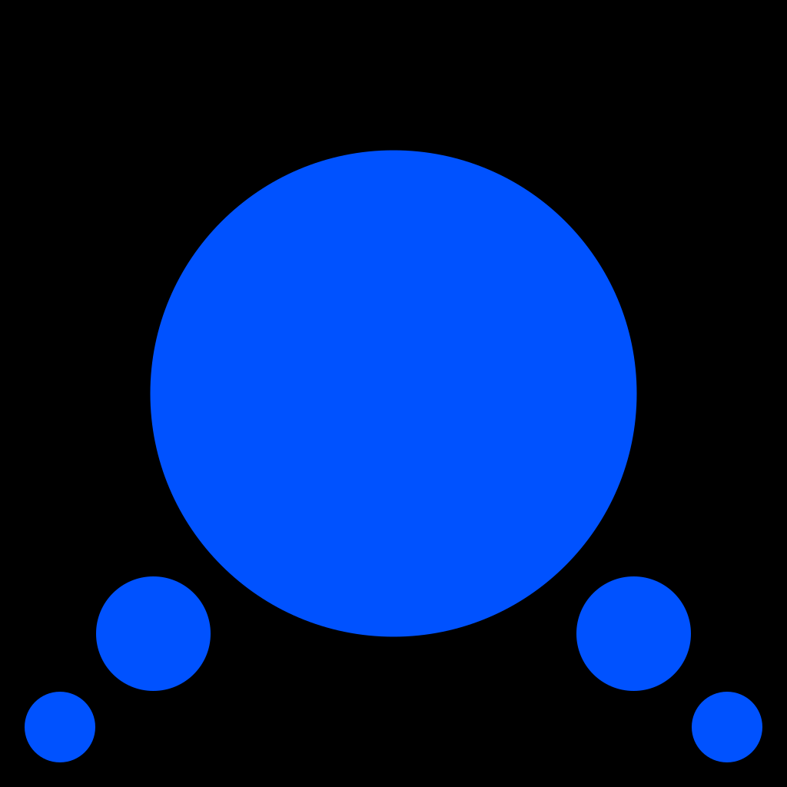

 

<h3 align="center">Blue Chat</h3>

    
    
    
    
    
    

## Libraries/Frameworks/Services used
Thanks to these amazing open source libraries and frameworks
- [Ionic Framework](https://ionicframework.com)
- [Capacitor](https://capacitorjs.com)
- [Cropper.js](https://fengyuanchen.github.io/cropperjs/)
- [React](https://reactjs.org)
- [Redux](https://redux.js.org)
- [i18next](https://www.i18next.com)
- [React Color](http://casesandberg.github.io/react-color/)
- [Parse](https://parseplatform.org)
- [Back4App](https://www.back4app.com)
- [RxDB](https://rxdb.info)

## Contributing for Translation

All text being added to Blue Privacy Extension is done initially in English (en) and then is translated by real people into other languages. We're missing translations for many languages and some translations might be incomplete or poor quality.

For everything you'd need to get started, check out [https://www.transifex.com/bluelockorg/blue-chat/](https://www.transifex.com/bluelockorg/blue-chat/)

We appreciate your support.
